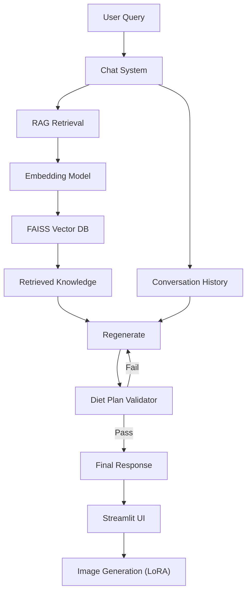

# WellGen AI - RAG-Powered Wellness Coach

**Personalized diet planning using Retrieval Augmented Generation (RAG) + Large Language Models**

## 🎯 Project Overview

WellGen AI is an advanced AI wellness coach that combines the power of Large Language Models with a Retrieval Augmented Generation (RAG) system grounded in real nutrition science. It features a modern, dark-themed UI with integrated image generation capabilities.

It features:
- **RAG Architecture**: Retrieves evidence-based nutrition info from Kaggle datasets
- **Production LLM**: Powered by Llama 3.3 70B via Groq
- **Conversation Memory**: Remembers your profile, diet plan, and chat history
- **Smart Validation**: Cross-checks generated plans for safety and accuracy
- **Visual Intelligence**: Generates anatomical visualizations and custom images

## ✨ Key Features

1.  **Personalized Diet Plans**: Generates 7-day meal plans based on age, weight, goals, and allergies.
2.  **RAG-Powered Knowledge**: Uses 750+ real nutrition documents (not synthetic data) for accuracy.
3.  **Modern UI**:
    *   **Dark Minimalist Theme**: Sleek, motivating interface.
    *   **Sidebar Access**: Diet plans and visualizations are neatly organized in the sidebar.
    *   **Smart Chat**: Right-aligned messages, auto-scroll, and clean input area.
4.  **Image Generation**:
    *   **Auto-Visualizations**: Automatically generates body part diagrams based on your plan.
    *   **Custom Images**: Use `/imagine <prompt>` to generate any image (e.g., `/imagine a healthy salad`).
    *   **Collage Mode**: Displays multiple images in a stylish grid.
5.  **Auto-Validation**: Every diet plan is automatically validated for calorie accuracy, allergy compliance, and nutritional balance.

## 🏗️ Architecture



## 🚀 Quick Start

### Prerequisites
- Python 3.8+
- [Groq API Key](https://console.groq.com/keys) (Free)

### 1. Setup Environment

```bash
# Install dependencies
pip install -r requirements.txt
```

### 2. Configure API Key

Create a `.env` file in the project root:

```env
GROQ_API_KEY=gsk_your_key_here
```

### 3. Run Application

```bash
# Run the application directly
streamlit run app.py
```

## 💡 Usage Guide

### Generating a Plan
When you start the app, it will ask for your profile details.
1.  Enter your age, weight, height, goal, etc.
2.  Click **Create My Plan**.
3.  The system will generate a diet plan and body visualizations.
4.  **Notification**: You'll see a "Diet Plan Ready!" message. Open the sidebar (top-left arrow) to view your plan.

### Chatting
After the plan is generated, you can ask follow-up questions naturally:
*   "Can you explain why you chose oatmeal for Monday breakfast?"
*   "I don't like fish, can you swap the dinner on Tuesday?"

### Image Generation
*   **Auto-Generated**: Check the sidebar for anatomical visualizations of body parts targeted by your plan.
*   **Custom Command**: Type `/imagine a futuristic gym` in the chat to generate custom images.

## 📁 Project Structure

```
wellgen-ai/
├── app.py                      # Main Streamlit Application
├── src/
│   ├── text_gen/               # Text generation module
│   │   ├── wellgen_rag.py      # Core RAG application logic
│   │   └── rag_system.py       # Vector database & retrieval system
│   ├── image_gen/              # Image generation module
│   │   ├── inference.py        # Image generation logic
│   │   └── ...
│   └── utils/                  # Data processing utilities
├── knowledge_base/             # Processed nutrition knowledge
├── data/                       # Raw Kaggle datasets
├── model/                      # Model artifacts
├── requirements.txt            # Project dependencies
└── .env                        # API keys (create this)
```

## 🔧 Technical Details

*   **Frontend**: Streamlit with custom CSS (Dark Theme)
*   **Embeddings**: `sentence-transformers/all-MiniLM-L6-v2` (384-dim)
*   **Vector DB**: FAISS (Facebook AI Similarity Search)
*   **LLM**: Llama 3.3 70B Versatile (via Groq API)
*   **Image Gen**: Stable Diffusion with LoRA
*   **Validation**: Secondary LLM call to cross-verify outputs

## 📝 License

MIT License - Academic Project 2025
