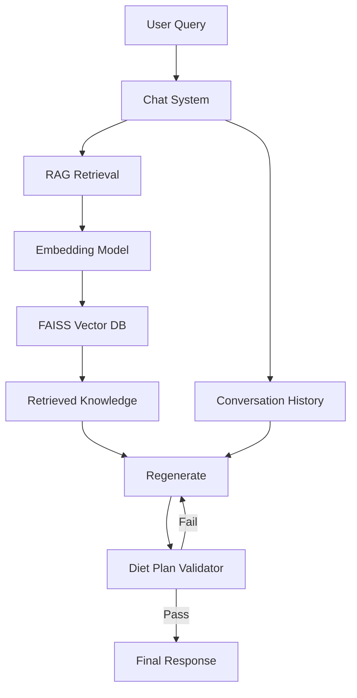

# WellGen AI - RAG-Powered Wellness Coach

**Personalized diet planning using Retrieval Augmented Generation (RAG) + Large Language Models**

## 🎯 Project Overview

WellGen AI is an advanced AI wellness coach that combines the power of Large Language Models with a Retrieval Augmented Generation (RAG) system grounded in real nutrition science.

It features:
- **RAG Architecture**: Retrieves evidence-based nutrition info from Kaggle datasets
- **Production LLM**: Powered by Llama 3.3 70B via Groq
- **Conversation Memory**: Remembers your profile, diet plan, and chat history
- **Smart Validation**: Cross-checks generated plans for safety and accuracy

## ✨ Key Features

1.  **Personalized Diet Plans**: Generates 7-day meal plans based on age, weight, goals, and allergies.
2.  **RAG-Powered Knowledge**: Uses 750+ real nutrition documents (not synthetic data) for accuracy.
3.  **Conversation Memory**: Remembers context! Ask "Will this help me?" after generating a plan, and it knows exactly what plan you're talking about.
4.  **Auto-Validation**: Every diet plan is automatically validated for:
    *   Calorie accuracy
    *   Allergy compliance
    *   Nutritional balance
    *   Completeness
5.  **Fast Inference**: Uses Groq's LPU for lightning-fast responses (~500 tokens/sec).

## 🏗️ Architecture



## 🚀 Quick Start

### Prerequisites
- Python 3.8+
- [Groq API Key](https://console.groq.com/keys) (Free)

### 1. Setup Environment

```bash
# Install dependencies
pip install -r requirements.txt
```

### 2. Configure API Key

Create a `.env` file in the project root:

```env
GROQ_API_KEY=gsk_your_key_here
```

### 3. Run Application

```bash
# Run the quick launcher
python start.py
```

## 💡 Usage Guide

### Generating a Plan
When you start the app, it will ask for your profile details.

```text
Your age: 25
Your gender: female
Your height: 165
Your weight: 70
Goal: Weight Loss
Allergies: peanuts
```

The system will:
1.  Retrieve relevant nutrition protocols
2.  Generate a 7-day plan
3.  **Validate** the plan (you'll see "🔍 Validating diet plan...")
4.  Present the plan if it passes checks

### Chatting
After the plan is generated, you can ask follow-up questions naturally:

*   "Can you explain why you chose oatmeal for Monday breakfast?"
*   "I don't like fish, can you swap the dinner on Tuesday?"
*   "Will this plan help me lose 5kg in a month?"

The bot remembers the plan and your profile!

## 📁 Project Structure

```
wellgen-ai/
├── start.py                    # Main entry point (Run this!)
├── wellgen_rag.py              # Core RAG application logic
├── rag_system.py               # Vector database & retrieval system
├── convert_kaggle_to_rag.py    # Data processing script
├── requirements.txt            # Project dependencies
├── knowledge_base/             # Processed nutrition knowledge
│   └── kaggle_nutrition.json
├── data/                       # Raw Kaggle datasets
└── model/                      # (Optional) Local model artifacts
```

## 🔧 Technical Details

*   **Embeddings**: `sentence-transformers/all-MiniLM-L6-v2` (384-dim)
*   **Vector DB**: FAISS (Facebook AI Similarity Search)
*   **LLM**: Llama 3.3 70B Versatile (via Groq API)
*   **Validation**: Secondary LLM call to cross-verify outputs

## 📝 License

MIT License - Academic Project 2025
